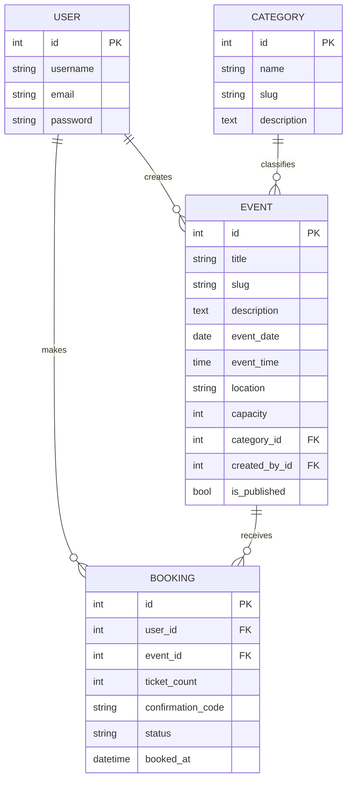

# Entity Relationship Diagram

## Actors

| Actor | Description |
|-------|-------------|
| Guest | Browse events; must register to book |
| Registered User | Book tickets, view/cancel bookings |
| Staff | CRUD events and categories via `/manage/` |
| Admin | Full access via Django admin |
